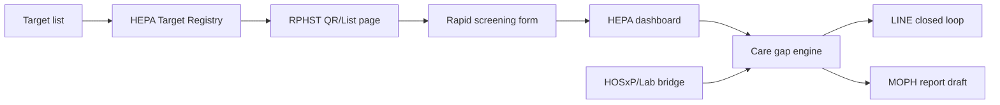

# HEPA-GLUE x hepa-connect Integration Guide

## Purpose

คู่มือนี้อธิบายการเชื่อม HEPA-GLUE กับ hepa-connect ตามรูปแบบล่าสุด:

**รายชื่อเป้าหมายกลาง -> รพ.สต. สแกน/เลือกจากรายชื่อ -> บันทึกผลคัดกรองเข้า HEPA -> LINE/แดชบอร์ดติดตาม -> HOSxP/Lab ยืนยันผลเฉพาะรายที่ต้องปิด loop**

ระบบนี้ไม่ใช้ JHCIS เป็นจุดเริ่มต้นของข้อมูลคัดกรองแล้ว

## Data Ownership

### Primary Source

รายชื่อเป้าหมายที่ทีมงานจัดทำและ mapping ให้แต่ละ รพ.สต.

ข้อมูลขั้นต่ำ:

| Field | Meaning |
| --- | --- |
| hn | HN |
| cid | เลขบัตรประชาชน หรือ masked CID ตามนโยบาย |
| name | ชื่อผู้ป่วย |
| birth_date | วันเกิด |
| subdistrict | ตำบล |
| village | หมู่ |
| service_unit_code | รหัส รพ.สต. |
| service_unit_name | ชื่อ รพ.สต. |

### Screening Result

รพ.สต. ส่งเข้า HEPA โดยตรง:

| Field | Meaning |
| --- | --- |
| hn | HN จากรายชื่อกลาง |
| rapid_hbv_result | ผล HBsAg rapid |
| rapid_hcv_result | ผล Anti-HCV rapid |
| test_date | วันที่ตรวจ |
| recorder_unit | หน่วยที่บันทึก |
| recorder_name | ผู้บันทึก ถ้ามี |

### Confirmation Source

HOSxP/Lab ใช้เฉพาะหลังคัดกรอง:

- HBsAg confirm
- Anti-HCV confirm
- HCV RNA
- วันที่รายงานผล
- สถานะพบแพทย์/รักษา

## Runtime Architecture



## LINE Role

LINE ไม่ใช่ฐานข้อมูลหลัก แต่เป็นช่องทาง closed loop:

- ผูก LINE userId กับ HN ผ่าน LIFF
- ส่งนัดและเตือนผู้ป่วย
- แจ้ง อสม./เจ้าหน้าที่เมื่อเกิด care gap
- เก็บ audit ว่าส่งอะไร เมื่อไร ให้ใคร

## API Status

ตรวจระบบ:

```bash
curl http://54.254.201.52/health
curl http://54.254.201.52/api/connection-status
curl http://54.254.201.52/api/production-automation
```

สถานะที่คาดหวัง:

- `target_registry`: ready
- `rphst_scan`: ready
- `line_bot`: ready เมื่อ token ถูกต้อง
- `hosxp_bridge`: optional/confirm source

## Deployment Notes

Cloud/VPS มองไม่เห็น IP ภายในโรงพยาบาล เช่น `172.16.x.x` หรือ `192.168.x.x` โดยตรง จึงไม่ควรออกแบบให้ cloud ดึง HOSxP โดยตรง

แนวทางที่ถูกต้อง:

1. รพ.สต. ส่งผลคัดกรองเข้า HEPA ผ่าน public web/LIFF
2. ถ้าต้องใช้ HOSxP/Lab ให้ IT ทำ read-only bridge ภายในโรงพยาบาล
3. Bridge ตอบเฉพาะผลยืนยัน ไม่ต้องส่งข้อมูลทุกอย่าง

## IT Request Template

ส่งให้ IT ได้:

```text
ขอทำ read-only HOSxP/Lab bridge สำหรับ HEPA เฉพาะข้อมูลยืนยันผลหลังคัดกรอง

ไม่ต้องดึงข้อมูลคัดกรองจาก JHCIS
HEPA จะใช้รายชื่อเป้าหมายกลางและให้ รพ.สต. ส่งผล rapid test เข้า HEPA โดยตรง

ข้อมูลที่ต้องการจาก HOSxP/Lab:
- HN
- HBsAg confirm
- Anti-HCV confirm
- HCV RNA
- วันที่รายงานผล
- สถานะพบแพทย์/เริ่มรักษา ถ้ามี

ขอเป็น read-only API พร้อม token
```

## Security

- ห้าม push `.env` จริง
- ใช้ HTTPS สำหรับ LINE webhook/LIFF
- token ทุกตัวเก็บบน VPS หรือ Secret Manager
- patient data ควร mask CID เมื่อแสดงต่อสาธารณะ

## Production Checklist

- [ ] รายชื่อเป้าหมายเข้า HEPA แล้ว
- [ ] mapping รพ.สต. ครบ
- [ ] รพ.สต. สแกน/เลือกจากรายชื่อได้
- [ ] ส่งผล rapid test เข้า HEPA ได้
- [ ] LINE identity mapping ทำงาน
- [ ] ส่ง LINE test ผ่าน
- [ ] HOSxP/Lab bridge พร้อมสำหรับ confirm result
- [ ] dashboard ตรวจยอดได้ราย รพ.สต.
