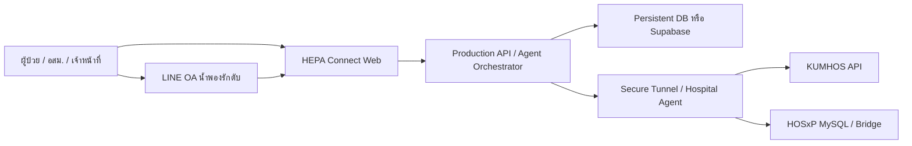

# Deploy HEPA-GLUE x hepa-connect

เอกสารนี้ใช้สำหรับเอาระบบขึ้น production บน VPS, AWS Lightsail หรือ Render โดยยังคงเชื่อม workflow LINE, agent, KUMHOS/HOSxP และหน้า HEPA-RAAIA ได้

## สรุปตัวเลือก

| ทางเลือก | เหมาะกับ | จุดที่ต้องระวัง |
| --- | --- | --- |
| VPS ทั่วไป | คุมเครื่องเอง, ตั้ง VPN/tunnel ได้, เก็บไฟล์ audit ในเครื่องได้ | ต้องดูแล OS, SSL, backup เอง |
| AWS Lightsail | VPS ที่จัดการง่ายกว่า, มี static IP และ snapshot | ยังต้องตั้ง Nginx/SSL/backup เอง |
| Render | ขึ้นเว็บเร็ว, auto deploy จาก Git, SSL พร้อม | ต่อ IP ภายใน รพ. เช่น 172.16.x.x / 192.168.x.x ไม่ได้โดยตรง ต้องมี agent/tunnel |

คำแนะนำสำหรับระบบนี้: ถ้าต้องคุยกับ HOSxP/KUMHOS ในวง LAN จริง ให้เลือก Lightsail/VPS พร้อม tunnel หรือรัน agent ไว้ในโรงพยาบาล ถ้าต้องการแค่ public app + LINE webhook เร็ว ๆ Render ใช้ง่ายที่สุด

## Architecture ที่ควรใช้จริง



เหตุผล: Cloud provider อยู่ข้างนอกวง LAN โรงพยาบาล จึงมองไม่เห็น `172.16.213.55` หรือ `192.168.215.21` โดยตรง ต้องมีอย่างใดอย่างหนึ่ง:

- วาง HEPA Hospital Agent ในเครื่องที่อยู่ในวง LAN แล้วให้ cloud เรียกผ่าน HTTPS/tunnel
- เปิด VPN site-to-site หรือ Tailscale/WireGuard
- ใช้ Cloudflare Tunnel จากเครื่องในโรงพยาบาลออกไปยัง cloud endpoint
- วางแอปทั้งตัวไว้บน server ภายในโรงพยาบาล แล้ว expose เฉพาะ HTTPS ผ่าน reverse proxy/tunnel

## Environment variables

ตั้งค่าใน `.env` บน VPS/Lightsail หรือหน้า Environment ของ Render ห้าม commit ค่า secret จริง

```env
NODE_ENV=production
HOST=0.0.0.0
PORT=3000

LINE_CHANNEL_ID=2010439606
LINE_CHANNEL_NAME=น้ำพองรักตับ
LINE_BOT_BASIC_ID=@290xergg
LINE_CHANNEL_SECRET=change-me
LINE_CHANNEL_ACCESS_TOKEN=change-me
LINE_PUSH_ENABLED=true
LINE_TEST_RECIPIENT_ID=change-me

VITE_LIFF_ID=change-me

KUMHOS_BASE_URL=http://172.16.213.55/kumhos/kumhos_lab_api
KUMHOS_USERNAME=change-me
KUMHOS_PASSWORD=change-me
KUMHOS_TEST_HN=0000001

HEPA_HOSXP_PROXY_URL=https://your-hospital-agent.example.go.th/hepa_glue_hepatitis_proxy.php
HEPA_HOSXP_PROXY_TOKEN=change-me

Z_AI_API_KEY=change-me
```

หมายเหตุ: ตอนนี้ agent store ใช้ไฟล์ `data/hepa-agent-store.json` ได้สำหรับเริ่มใช้งานบน VPS แต่ production ระยะยาวควรย้ายไป Supabase/Postgres หรือ mount persistent disk เพราะ Render filesystem อาจหายเมื่อ redeploy ถ้าไม่ได้ตั้ง disk

## Build และ Run

คำสั่งกลางของโปรเจกต์:

```bash
corepack enable
pnpm install --frozen-lockfile
NODE_OPTIONS=--max-old-space-size=4096 pnpm build
pnpm start
```

`pnpm start` จะเปิด `server.mjs` และ listen ตาม `PORT`

## Deploy บน Render

1. Push repo ขึ้น GitHub
2. เข้า Render แล้วสร้าง Blueprint จาก `render.yaml` หรือสร้าง Web Service เอง
3. ตั้ง Build Command:

```bash
corepack enable && pnpm install --frozen-lockfile && pnpm build
```

4. ตั้ง Start Command:

```bash
pnpm start
```

5. ใส่ Environment variables ทั้งหมดในหน้า Render
6. ถ้าต้องใช้ HOSxP/KUMHOS ภายใน รพ. ให้ตั้ง `HEPA_HOSXP_PROXY_URL` เป็น public HTTPS ของ hospital agent/tunnel

เหมาะสำหรับ: public dashboard, LINE webhook, LINE LIFF linking, agent orchestrator ที่ไม่ต้องต่อ LAN ตรง

## Deploy บน AWS Lightsail หรือ VPS Ubuntu

ตัวอย่างนี้ใช้ path `/opt/hepa-connect`

```bash
sudo apt update
sudo apt install -y nginx git curl
curl -fsSL https://deb.nodesource.com/setup_22.x | sudo -E bash -
sudo apt install -y nodejs
sudo corepack enable

sudo mkdir -p /opt/hepa-connect
sudo chown -R $USER:$USER /opt/hepa-connect
git clone https://github.com/Phakamas1715/hepa-connect.git /opt/hepa-connect
cd /opt/hepa-connect

pnpm install --frozen-lockfile
NODE_OPTIONS=--max-old-space-size=4096 pnpm build
```

สร้างไฟล์ `.env` บน server แล้วคัดลอกจาก `.env.example` โดยใส่ secret จริงเฉพาะบนเครื่อง server

```bash
sudo cp deploy/hepa-connect.service /etc/systemd/system/hepa-connect.service
sudo systemctl daemon-reload
sudo systemctl enable --now hepa-connect
sudo systemctl status hepa-connect
```

ตั้ง Nginx:

```bash
sudo cp deploy/nginx-hepa-connect.conf /etc/nginx/sites-available/hepa-connect
sudo ln -s /etc/nginx/sites-available/hepa-connect /etc/nginx/sites-enabled/hepa-connect
sudo nginx -t
sudo systemctl reload nginx
```

จากนั้นติดตั้ง SSL ด้วย Certbot หรือใช้ reverse proxy/tunnel ที่มี SSL ให้แล้ว

## Deploy ด้วย Docker

```bash
docker build -t hepa-connect .
docker run -d --name hepa-connect --env-file .env -p 3000:3000 hepa-connect
```

ถ้าใช้ Docker Compose ให้ mount `./data:/app/data` เพื่อเก็บ invite/audit ไม่ให้หาย

## LINE webhook และ LIFF

หลัง deploy แล้วให้ตั้งใน LINE Developers:

- Webhook URL: `https://hepa.namphonghospital.go.th/api/line-webhook`
- LIFF Endpoint URL: `https://hepa.namphonghospital.go.th/line/link`
- Callback/Endpoint ต้องเป็น HTTPS

ถ้าใช้ Render จะได้ HTTPS อัตโนมัติ ถ้าใช้ VPS/Lightsail ต้องมี SSL ก่อน LINE จะใช้งานจริงได้

## Production checklist

- เปิด HTTPS แล้ว
- ตั้ง `LINE_PUSH_ENABLED=true`
- ตั้ง secret ใน environment เท่านั้น
- ตั้ง persistent storage หรือ database ให้ agent store
- Hospital agent/tunnel ต่อถึง KUMHOS/HOSxP ได้
- `/api/production-automation` readiness เป็น 100
- ทดสอบสร้าง QR ใน `/patients`
- ทดสอบผูก LINE ผ่าน `/line/link?token=...`
- ทดสอบส่ง LINE จริงหนึ่งเคสก่อนปล่อยกลุ่มใหญ่

## แหล่งอ้างอิง

- Render Node deploy: https://render.com/docs/deploy-node-express-app
- AWS Lightsail Node.js stack: https://docs.aws.amazon.com/lightsail/latest/userguide/amazon-lightsail-quick-start-guide-nodejs.html
- Cloudflare Tunnel setup: https://developers.cloudflare.com/tunnel/setup/
- Cloudflare Tunnel service on Linux: https://developers.cloudflare.com/cloudflare-one/networks/connectors/cloudflare-tunnel/do-more-with-tunnels/local-management/as-a-service/linux/
